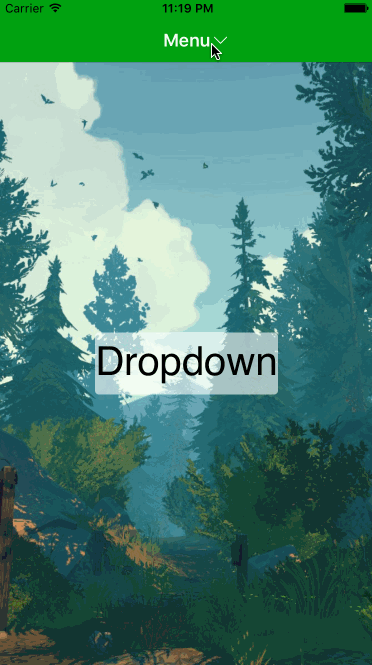
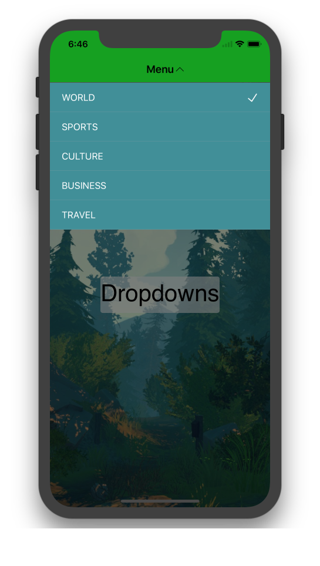

# Dropdowns

❤️ Support my app ❤️ 

- [Push Hero - pure Swift native macOS application to test push notifications](https://www.producthunt.com/posts/push-hero-2)
- [Quick Access - Organise files in the Mac menu bar](https://www.producthunt.com/posts/quick-access)
- [Frame recorder - Recorder gif and video with frame](https://www.producthunt.com/posts/frame-recorder)
- [Other apps](https://onmyway133.github.io/projects/)

❤️❤️😇😍🤘❤️❤️

Dropdown in Swift

[](http://cocoadocs.org/docsets/Dropdowns)
[](http://cocoadocs.org/docsets/Dropdowns)
[](http://cocoadocs.org/docsets/Dropdowns)


<div align="center">
	
	
</div>

## Usage

`Dropdowns` provides the quickest way to present a dropdown in your app. It is very lightweight, just provide a list of items and the action closure you want to handle.

### Basic

`Dropdowns` works by showing a child `UIViewController` as a dropdown from a `TitleView`. The most common use case is to show from a `UINavigationController`, in that sense, you can just create a list of items, and provide to `TitleView`.

```swift
let items = ["World", "Sports", "Culture", "Business", "Travel"]
let titleView = TitleView(navigationController: navigationController!, title: "Menu", items: items)
titleView?.action = { [weak self] index in
  print("select \(index)")
}

navigationItem.titleView = titleView
```

### Customization

`Dropdowns` uses `TableController` by default, to show list of items in a `UITableView`. You can customise to show anything you want by using `contentController`.

```swift
let contentController = TableController(items: items, initialIndex: 0)
let dropdown = DropdownController(contentController: contentController, navigationController: navigationController)
```

### Configuration

You can also customise many aspects of `Dropdowns` via `Config`

```swift
Config.List.DefaultCell.Text.color = UIColor.redColor()
```

## Installation

**Dropdowns** is available through [CocoaPods](http://cocoapods.org). To install
it, simply add the following line to your Podfile:

```ruby
pod 'Dropdowns'
```

**Dropdowns** is also available through [Carthage](https://github.com/Carthage/Carthage).
To install just write into your Cartfile:

```ruby
github "onmyway133/Dropdowns"
```

**Dropdowns** can also be installed manually. Just download and drop `Sources` folders in your project.

## Author

- Khoa Pham, onmyway133@gmai.com

## Credit

- Hyper Interaktiv AS, ios@hyper.no

## Contributing

We would love you to contribute to **Dropdowns**, check the [CONTRIBUTING](https://github.com/onmyway133/Dropdown/blob/master/CONTRIBUTING.md) file for more info.

## License

**Dropdowns** is available under the MIT license. See the [LICENSE](https://github.com/onmyway133/Dropdown/blob/master/LICENSE.md) file for more info.
